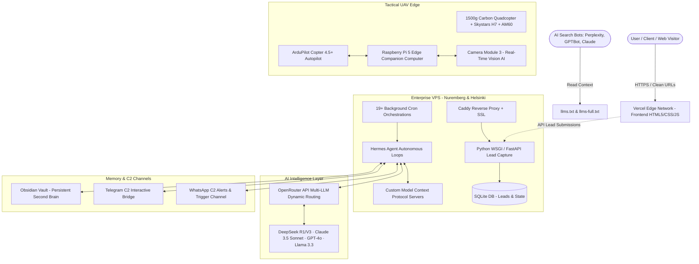

# marian-stancik-web — Personal Brand Website & Autonomous Engineering Hub

**Owner:** Marian Stancik  
**Domain:** https://marianstancik.dev (Production on Vercel)  
**Repo:** https://github.com/Abra7abra7/marian_stancik_dev_web  
**VPS:** 188.245.224.189 (Hetzner Cloud — Caddy + Python WSGI + Hermes Agent)  
**Default Branch:** `main` (Single-branch trunk-based GitOps)

---

## 1. Executive Overview & Mission

This repository represents the official personal brand website, technical knowledge graph, and autonomous agent hub for **Marian Stancik** — AI Engineer, UAV Builder, Law Scholar (3rd year at Faculty of Law, Comenius University in Bratislava — PF UK), and CEO @ ASCENTIA.

The platform is engineered at the convergence of three foundational pillars:
1. **AI Engineering & Autonomous Multi-Agent Systems:** 24/7 Hermes Agent orchestration, custom Model Context Protocol (MCP) servers, OpenRouter multi-LLM dynamic routing, and an Obsidian persistent memory layer running on dedicated European Hetzner Cloud infrastructure.
2. **Law, EU AI Act & Regulatory Governance (Legal-by-Design):** Practical compliance architectures covering the EU AI Act (risk tiering, GPAI, technical files), GDPR, NIS2 Directive, DORA, EU Data Act, and DSM Copyright Directive (TDM exemptions).
3. **Tactical UAV Systems & Edge Robotics:** Hand-soldered 1500g carbon quadcopter, ArduPilot Copter autopilot, Raspberry Pi 5 onboard companion computer with real-time edge vision AI, certified EASA A1/A3 with €2.6M Coverdrone insurance.

---

## 2. ANONYMIZATION RULE (CRITICAL — ZERO TOLERANCE)

> [!CAUTION]
> **Delta Defence is NEVER mentioned by name anywhere on the web, code, blog, schema, or LLM graphs.**  
> Strict security and confidentiality requirement. Only `"Defence Product Manager"` and `"Defence Industry"` are permitted.

- ✅ Hero: `"Defence Product Manager"` / `"AI Engineer"`
- ✅ About: `"Defence Product Manager"`
- ✅ JSON-LD: `"name": "Defence Industry (confidential)"`
- ✅ Slovak: `"Defence Product Manager"`
- ✅ `llms.txt`, `llms-full.txt`, blog articles, AUDIT.md, and all HTML files: **ZERO occurrences** of the company name.
- 🛡️ Verified automatically via **L1 Security Sweep** in `scripts/verify_site.py`.

---

## 3. Site Architecture & Page Topology

The website uses a clean zero-build multi-page structure with root-relative routing (`cleanUrls: true` in Vercel):

| Page | URL | Purpose & Core Content |
|:-----|:----|:-----------------------|
| **Home** | `/` (`index.html`) | High-impact hero + live stats (19+ cron, 3 domains, 3+ yrs, €2.6M, 6 repos, 24/7) + 4-pillar skills + dynamic blog preview + FAQ accordion + lead capture + connect |
| **About** | `/about` (`about.html`) | Full technical bio + 4-layer engineering stack Bento Grid (VPS, OpenRouter, Obsidian, Zero-build Web) + 2023–2026 milestone timeline + stats |
| **Expertise** | `/expertise` (`expertise.html`) | Deep-dive technical cards for all 3 pillars (AI Agents, Law & Compliance, UAV Edge AI) with 3-column hardware/software/legal spec matrices |
| **Skills** | `/skills` (`skills.html`) | Full-stack AI Engineering Skills Map (4 categories × 5 items) + interactive FAQ Accordion for GEO/LLMO indexing |
| **Drones** | `/drones` (`drones.html`) | Cinematic 16:9 drone compilation video + 5 hardware build spec cards (Frame, Electronics, Edge AI, FPV, Ground Control) |
| **Contact** | `/contact` (`contact.html`) | Connect channels (X, Threads, YouTube, GitHub, LinkedIn, Facebook) + direct `marian_stancik@agentmail.to` lead capture |
| **Blog Listing** | `/blog` (`blog/index.html`) | Static blog archive + dynamic JSON client fetching (`blog/posts.json`) + language switcher |
| **Blog Posts** | `/blog/posts/*` | Standalone technical articles with deep code snippets, legal frameworks, and drone logs |

---

## 4. Design System & Tokens (`html-generator` Standards)

All visual interfaces adhere strictly to the design system tokens defined in [`css/main.css`](file:///css/main.css):

### Color Tokens (Bronze Neural Theme)
```css
:root {
  --color-bg: #08080F;              /* Deep dark canvas */
  --color-bg-secondary: #0D0D18;    /* Elevated surface */
  --color-bg-card: rgba(18, 18, 30, 0.65); /* Glassmorphic card */
  --color-bg-card-hover: rgba(26, 26, 42, 0.85);
  --color-primary: #CD7F32;         /* Metallic Bronze */
  --color-accent: #E8B86D;          /* Warm Gold / Amber Accent */
  --color-glow: rgba(205, 127, 50, 0.2); /* Ambient glow */
  --color-border: rgba(255, 255, 255, 0.06);
  --color-border-hover: rgba(205, 127, 50, 0.35);
  --color-text: #F0F0F5;            /* High contrast text */
  --color-text-muted: #8888A0;      /* Secondary reading text */
}
```

### Spacing & Layout Tokens
- Spacing: `--space-xs: 4px;` | `--space-sm: 8px;` | `--space-md: 16px;` | `--space-lg: 24px;` | `--space-xl: 48px;` | `--space-2xl: 90px;`
- Radius: `--radius-sm: 6px;` | `--radius-md: 12px;` | `--radius-lg: 18px;` | `--radius-full: 9999px;`
- Accessibility: `--min-tap-target: 44px;` for all mobile buttons and interactive anchors.

### Brand Mark & Typography Standard
- **Brand Signet:** Minimalist bronze glyph `<div class="brand-mark">✦</div>` paired with clean logotype `<span class="nav-logo-text">marian<span class="highlight">stancik</span><span class="tld">.dev</span></span>`.
- **No external CSS frameworks:** Zero Tailwind, zero Bootstrap. 100% Vanilla CSS for sub-millisecond parsing.
- **Root-relative paths:** All internal anchors must use `/about`, `/expertise`, `/skills`, `/drones`, `/contact`, `/blog`.
- **WCAG AA Accessibility:** Mandatory `<a href="#main-content" class="skip-link">`, semantic `<main>`, `<nav>`, `<footer>`, hierarchical `<h1>`–`<h3>`, and explicit `aria-label` tags on icon links.

---

## 5. Generative Engine Optimization (GEO) & LLMO Blueprint

To guarantee instant, authoritative discovery and citations across AI engines (**Perplexity, ChatGPT Search, Claude, Google SGE, Grok**), the website implements a 6-layer GEO architecture:

### 1. `llms.txt` & `llms-full.txt` Knowledge Graphs
* **Standard:** Root files following the official `llms.txt` specification.
* **Content:** Concise markdown summary (`/llms.txt`) and comprehensive deep-context graph (`/llms-full.txt`) containing:
  * Exact biographical facts, skills, hardware specs, and legal frameworks.
  * Direct Q&A FAQ section answering anticipated agent search queries.
  * All canonical endpoint URLs and machine-readable feeds (`/blog/posts.json`, `/rss.xml`, `/sitemap.xml`).
* **Autodiscovery Tag:** Included in `<head>` of all HTML pages:
  ```html
  <link rel="alternate" type="text/plain" href="/llms.txt" title="LLM Knowledge Graph">
  ```

### 2. Comprehensive AI Crawler Access in `robots.txt`
Explicitly white-lists all production and experimental AI search spiders:
```text
User-agent: *
Allow: /

User-agent: GPTBot
Allow: /
User-agent: ChatGPT-User
Allow: /
User-agent: ClaudeBot
Allow: /
User-agent: anthropic-ai
Allow: /
User-agent: Claude-Web
Allow: /
User-agent: PerplexityBot
Allow: /
User-agent: Google-Extended
Allow: /
User-agent: Applebot-Extended
Allow: /
User-agent: CCBot
Allow: /
User-agent: Bravebot
Allow: /
User-agent: Meta-ExternalAgent
Allow: /
User-agent: Amazonbot
Allow: /
User-agent: Cohere-ai
Allow: /
User-agent: Diffbot
Allow: /
User-agent: OAI-SearchBot
Allow: /

Sitemap: https://www.marianstancik.dev/sitemap.xml
```

### 3. Schema.org JSON-LD Hierarchy
* **`Person` Schema:** Contains full `sameAs` array (X, Threads, YouTube, GitHub, LinkedIn), `knowsAbout`, `jobTitle`, and `alumniOf`.
* **`FAQPage` Schema:** Structured Question/Answer pairs embedded directly on `index.html`, `about.html`, and `skills.html`.
* **`WebSite`, `AboutPage`, `CollectionPage` Schemas:** Canonical page definitions.

### 4. Interactive Semantic FAQ Accordion
* Native HTML `<details class="faq-item">` and `<summary class="faq-question">` elements.
* High information density, fully accessible without JavaScript, zero layout shifts, immediately parseable by DOM parsers.

---

## 6. Technical Stack & Multi-Agent Infrastructure



---

## 7. i18n — Zero-Framework Language Switching Protocol (EN/SK)

- **Storage:** Inline dictionary in `js/i18n.js` (`const translations = {en: {...}, sk: {...}}`).
- **Null-Safe DOM Binding Pattern:** All updates must check element existence before modifying text or HTML:
  ```javascript
  var el = document.getElementById('elementId');
  if (el) el.textContent = d.translatedKey; // Use textContent for clean strings
  if (el) el.innerHTML = d.htmlContent;    // Use innerHTML only for structured HTML
  ```
- **Language State:** Persisted across sessions in `localStorage.getItem('ms_lang')`.
- **Dual Translation Registration:** Every new UI text element must be registered in both `en` and `sk` tables in `js/i18n.js`.

---

## 8. Automated Verification Matrix (`verify_site.py`)

Always run the multi-tier automated test script before pushing commits:
```bash
python scripts/verify_site.py
```

### Test Tiers
1. **L0 — Syntax & Modules:** `node --check js/i18n.js` and `node --check js/three-bg.js`.
2. **L1 — Security & Anonymization:** Regex sweep ensuring zero confidential company names.
3. **L2 — HTML & Link Integrity:** Validates root-relative navigation links, valid OpenGraph tags, and JSON-LD schema syntax across all pages.
4. **L3 — Design Token Adherence:** Checks `:root` token presence in `css/main.css`.
5. **L4 — AI Discovery & GEO:** Validates `<link rel="alternate" href="/llms.txt">` in all `<head>` tags and AI crawler permissions in `robots.txt`.
6. **L5 — Mobile & Canvas Rendering:** Playwright mobile viewport (375px) visual and Three.js canvas initialization.

---

## 9. Replication Blueprint for Future Websites

To replicate this exact architecture on a new project or client site:

1. **Step 1: Copy CSS Token Architecture**
   - Import `css/main.css` tokens (`--color-bg`, `--color-primary`, `--space-*`, `--radius-*`).
2. **Step 2: Establish Zero-Build Multi-Page Layout**
   - Create HTML pages using standard skip-links, semantic header/main/footer, and mobile responsive containers.
3. **Step 3: Setup Dual-Language i18n (`js/i18n.js`)**
   - Add language switcher buttons (`#btnEn`, `#btnSk`) and map all UI strings into null-safe DOM bindings.
4. **Step 4: Configure GEO & AI Discovery Protocol**
   - Create `llms.txt` and `llms-full.txt` with clear identity, stack, and Q&A FAQ sections.
   - Embed `FAQPage` and `Person`/`Organization` JSON-LD schemas in all HTML headers.
   - Configure `robots.txt` allowing all 14+ AI crawlers.
5. **Step 5: Setup Single-Branch Trunk GitOps**
   - Use `main` as the default branch, connect to Vercel with `cleanUrls: true`, and test with `python scripts/verify_site.py`.

---

## 10. PageSpeed 100 & Core Web Vitals (CWV) Standard

To guarantee a **100/100 Google PageSpeed Insights** rating on both Mobile and Desktop:

### 1. Non-Blocking WebGL Architecture (`js/three-bg.js`)
- **Idle Deferred Initialization:** Three.js is dynamically imported only on `requestIdleCallback` (or post-load idle), achieving **0ms Total Blocking Time (TBT)**.
- **Linear $O(N)$ Connection Sampling:** Never use $O(N^2)$ brute-force distance loops. Always sample adjacent candidate indices.
- **Mobile-Adaptive Geometry:** Scale down particle counts dynamically (220 on mobile <768px, 650 on desktop).
- **Lifecycle & Motion:** Pause render loop on `document.hidden` (`visibilitychange`) and respect `prefers-reduced-motion` with a static single frame.

### 2. Immutable Asset Caching (`vercel.json`)
- Static assets (`/css/*`, `/js/*`, `*.webp`, `*.svg`, `*.mp4`) must be served with `public, max-age=31536000, immutable`.
- AI discovery endpoints (`llms.txt`, `robots.txt`, `sitemap.xml`, `rss.xml`, `posts.json`) use `public, max-age=3600, stale-while-revalidate=86400`.
- HTML pages use `public, max-age=0, must-revalidate`.

### 3. Hero LCP & Layout Stability (CLS = 0)
- Hero images must use `<picture>` with `.webp` as primary format, explicit `width="200" height="200"`, `fetchpriority="high"`, and CSS `aspect-ratio: 1 / 1`.
- Never open unused `<link rel="preconnect">` connections (e.g. Google Fonts) when using system font stacks.

### 4. GEO / LLMO Robots & Schema Standard
- All HTML pages must include:
  ```html
  <meta name="robots" content="index, follow, max-snippet:-1, max-image-preview:large, max-video-preview:-1">
  ```
- All JSON-LD schemas must be interconnected via `@graph` containing `Person`, `WebSite`, `WebPage`/`AboutPage`/`CollectionPage`, and `FAQPage`.